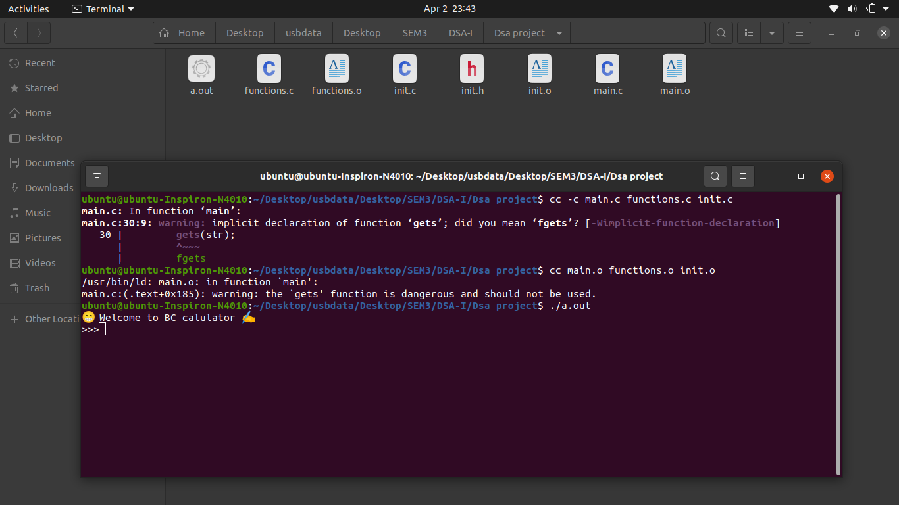
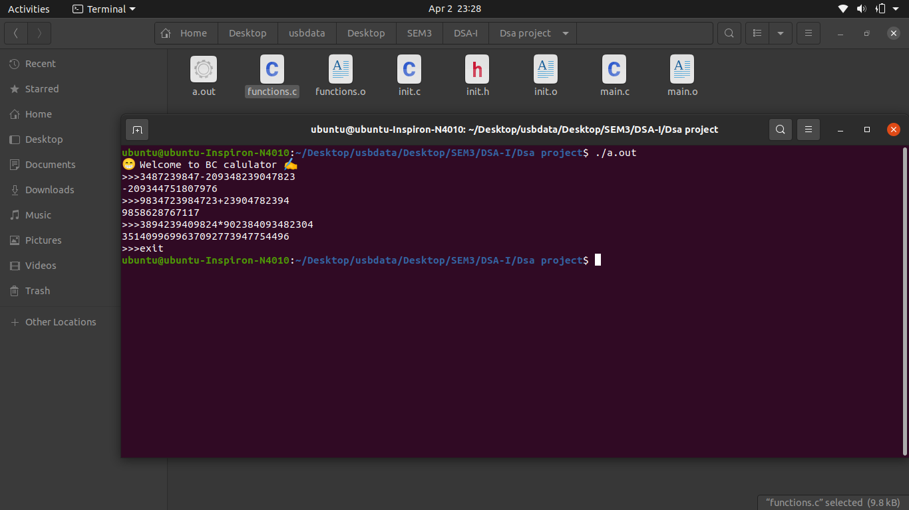
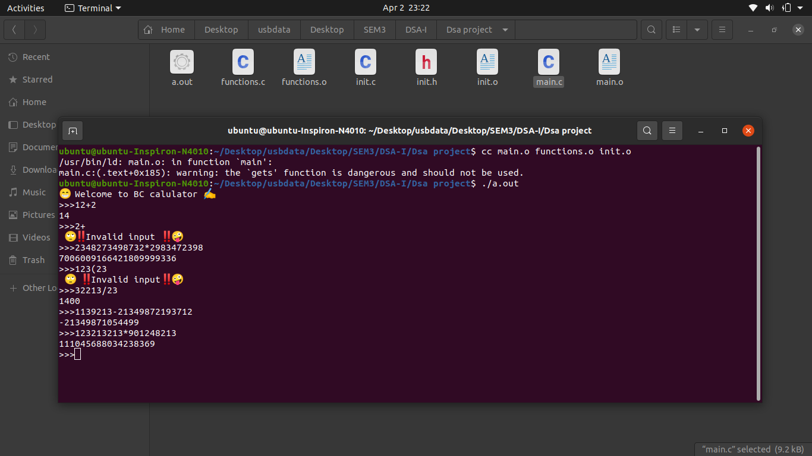

# BC Command
 
## Features
   - It can handle large number calculations
   - It is easy to use simply open command line and run it
   - It is also known as infinite precision calulator
   
## How to use it ??
## Screenshots
- How to run in your computer

- The output

- Gives error when giving incorrect input

